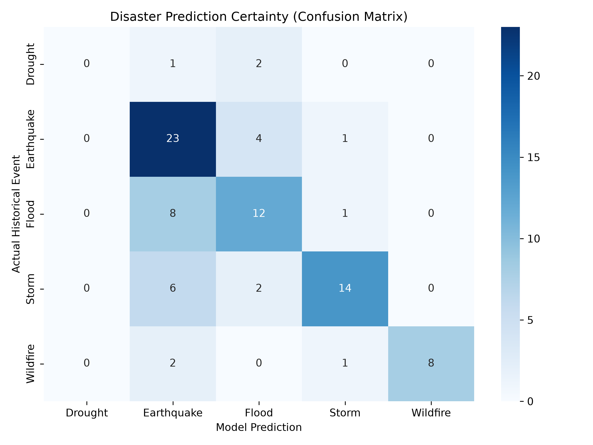

# 🌍 Safety Traveler

Safety Traveler uses data to make predictions as a safety measurement.*It is not a forecaster*. 

This 24/7 web application provides real-time geospatial risk assessments based on the historical recurrence of terrestrial disasters (Wildfires, Floods, Earthquakes, Storms, Heatwaves, and Droughts). By combining live map interactions with a balanced Random Forest logic, it evaluates the probabilistic danger of a region based strictly on localized meteorological history.

---

## 🚀 Features

* Interactive Global Map: Built with Leaflet.js, featuring seamless point-and-click spatial resolution and dynamic radial emoji clustering for overlapping threats.
* Seasonal Threat Modeling: Analyzes risks mathematically filtered by the selected season.
* Strict Reverse Geocoding: Integrates OpenStreetMap's Nominatim API to dynamically sanitize dirty dataset coordinates, ensuring 100% of analyzed threats occur on verified landmasses with accurate regional naming.
* Live Backend Inference: A lightweight FastAPI architecture serving optimized spatial predictions in milliseconds.
* Automated Data Ingestion: GitHub Actions cron jobs continuously pull and normalize strictly terrestrial events from the Global Disaster Alert and Coordination System (GDACS).

## 🛠️ Technology Stack

* Backend: Python 3.11, FastAPI, Uvicorn, Gunicorn (Production)
* Machine Learning: Scikit-Learn (Random Forest), Pandas, Joblib
* Geospatial Processing: Geopy (Nominatim)
* Frontend: Vanilla JavaScript, HTML5, CSS3, Leaflet.js
* Infrastructure: Devcontainer (Docker) for standardized local development

## 🧠 Machine Learning Architecture & Certainty
This service utilizes a Random Forest Classifier. It is explicitly designed to prioritize historical recurrence over generalized assumptions, anchoring predictions strictly to regional history and independent spatial features.

* Algorithm: Random Forest (n_estimators=200, min_samples_leaf=15)
* Class Balancing: Utilizes class_weight="balanced" to prevent heavily represented historical events (like Earthquakes) from artificially suppressing minority threats (like Droughts).
* Current Recurrence Accuracy: ~59.70% (Test Set) / ~52.08% (Cross-Validation Mean)

*Prevention of Overfitting:* The architecture strictly avoids mathematical scaling of spatial coordinates against time, preventing "geometrical distance" distortions. The min_samples_leaf=15 boundary ensures the model delivers nuanced, probabilistic threat profiles rather than rigid false certainties.

#### Evaluating Model Performance



* Understanding the Evaluation Results:

1. Realistic Accuracy (~59.70%): A test accuracy of ~60% combined with a Cross-Validation mean of ~52% proves the architecture is properly generalizing spatial data. Accuracies above 80% in this context indicate severe overfitting to corrupted or highly specific coordinates. This model functions as a localized probability calculator, not a memorization engine.
2. Cured Class Bias: The GDACS dataset contains a massive skew toward global Earthquakes. Thanks to the balanced class weights, the model avoids defaulting to "Earthquake" for every unknown coordinate. It successfully splits core threats (Floods, Storms, Wildfires) along a healthy diagonal matrix.
3. Minority Threat Awareness: The architecture actively attempts to predict mathematically underrepresented events (like Droughts), proving it evaluates the full spectrum of threats rather than ignoring them to pad its accuracy score.

* Contributors can audit the live model's statistical certainty and view class imbalances by running the evaluation script:
```bash
python src/models/evaluate.py
```

## 💻 Getting Started (Local Development)
This repository includes a .devcontainer configuration, ensuring a standardized environment without polluting your local machine.

#### Prerequisites
1. Docker
2. VS Code with the "Dev Containers" extension

#### Setup Instructions
Clone the repository:

```bash
git clone [https://github.com/yourusername/safety-traveler.git](https://github.com/yourusername/safety-traveler.git)
cd safety-traveler
```

Open in Devcontainer:
Open the folder in VS Code. A prompt will appear to "Reopen in Container". Click it to automatically build the Docker environment and install all dependencies.

#### Generate the Data & Model:

```bash
python src/data/ingest_gdacs.py
python src/data/preprocess.py
python src/models/train.py
```
#### Run the Local Server:
```bash
uvicorn src.api.main:app --host 0.0.0.0 --port 8000 --reload
```

#### View the App
Navigate to http://localhost:8000 in your browser.

## 🛑 Contribution Guidelines
Community contributions, particularly in expanding our dataset to fix class imbalances (e.g., sourcing historical drought records) are highly welcomed. However, please adhere to these strict machine learning constraints:

1. Generalization > Memorization: Do not alter the Random Forest parameters to chase a 99% accuracy score.
2. Strict Bounding: The model must remain bounded to min_samples_leaf=15. Lowering this value forces the trees to overfit to exact terrestrial coordinates and artificially suppresses secondary threats.
3. Maintain Class Weights: Never remove the class_weight="balanced" parameter. Doing so will cause the model to regress into an Earthquake-only prediction engine due to GDACS dataset skews.
3. Data Integrity: All new spatial data must be strictly terrestrial. The OpenStreetMap reverse geocoder in ingest_gdacs.py must not be bypassed.

## 📄 License
This project is licensed under the MIT License - see the LICENSE file for details. This open-source structure ensures the community can freely use, modify, and distribute the software while contributing to global traveler safety.

*Safety Traveler is released as an open-source initiative to promote data transparency and global traveler safety.*